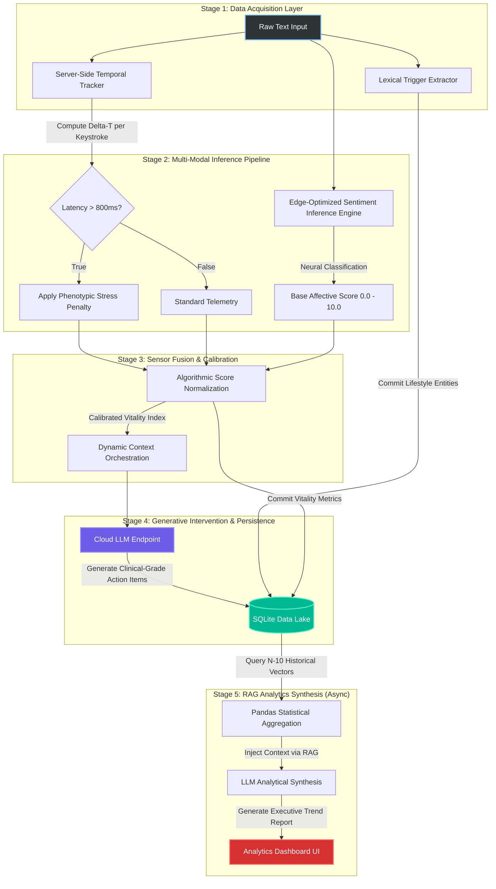

# 🧠 AntarMitra: Cognitive Wellness & Behavioral Telemetry System

**AntarMitra** is an AI-driven, privacy-centric behavioral analytics platform engineered to continuously monitor, evaluate, and synthesize human emotional states. It integrates high-dimensional natural language processing, digital phenotyping, and retrieval-augmented generation (RAG) to passively detect cognitive fatigue, analyze stressors, and recommend clinical-grade interventions through a highly reactive web interface.

---

## 🌟 Key Features

### ⌨️ Digital Phenotyping & Temporal Analysis
* Tracks high-resolution keystroke latency utilizing a proprietary, server-side temporal engine.
* Passively detects physiological markers of cognitive load and hesitation.
* Applies algorithmic thresholds (e.g., latency > 800ms) to trigger phenotypic stress penalties.

### 📝 Edge-Optimized NLP Inference
* Performs multi-class emotional classification using an embedded, high-dimensional affective neural network.
* Executes sentiment inference entirely on-device to guarantee stringent user data privacy.
* Extrapolates primary contextual stress triggers (e.g., Financial, Occupational, Somatic) via optimized semantic entity extraction.

### 🤖 RAG-Powered Clinical Synthesis
* Implements a Retrieval-Augmented Generation (RAG) pipeline for longitudinal data synthesis.
* Aggregates historical user data and executes statistical smoothing (moving averages, trigger severity impact).
* Auto-generates high-fidelity, personalized Executive Trend Reports via decoupled Cloud LLM endpoints.

### 📊 Multi-Dimensional Data Visualization
* Transforms raw relational data into interactive, dynamic data visualizations.
* Computes real-time severity metrics across distinct lifestyle stress factors.
* Triggers dynamic UI interventions (e.g., algorithmic guided breathing protocols) during high-stress inputs.

---

## 🛠️ Tech Stack

### Core Technologies
* Python 3.9+
* Streamlit (Component-based UI Router)
* SQLite3 (Embedded Relational Data Storage)
* Pandas (Statistical Aggregation & Vector Processing)
* Plotly Express (Interactive Visualization)

### AI/ML Components
* Self-Attention Neural Text Encoders (Affective Scoring)
* Server-Side Temporal Tracker (Biometric Telemetry)
* TensorFlow / Keras (Backend Tensor Processing)
* Scikit-Learn (Algorithmic Utilities)

### APIs & Services
* Cloud-Native Generative AI APIs (Inference Engine)

---

## 🧠 Architecture Overview



Visual representation of the deterministic, 5-stage sensor fusion and inference pipeline.

---

## 📁 Project Structure

```text
AntarMitra/
├── src/
│   ├── ai_coach.py            # LLM API orchestration & Context Management
│   ├── analytics_dashboard.py # Tab 2: Aggregation & RAG pipeline routing
│   ├── database_manager.py    # CRUD operations and schema migrations
│   ├── journal_interface.py   # Tab 1: Biometric capture & text parsing
│   ├── local_ai.py            # Local Neural Network inference setup
│   └── trigger_analysis.py    # NLP rule-based entity extraction
├── assets/
│   └── theme.css              # Custom Glassmorphism UI Injector
├── database/
│   └── antarmitra.db          # SQLite storage
├── main.py                    # Application Entry Point & Route Controller
└── requirements.txt           # Dependency Manifest
```

---

## 🚀 Getting Started

### ✅ Prerequisites
* Python 3.9 or higher
* `pip` (Python package manager)
* Git
* (Recommended) Virtual environment tool: `venv` or `conda`

### 📦 Installation

```bash
git clone https://github.com/yourusername/antarmitra.git
cd antarmitra
python -m venv venv
source venv/bin/activate       # On Windows: .\venv\Scripts\activate
pip install -r requirements.txt
```

### 🔐 Configure Environment Variables

```bash
cp .env.example .env
# Edit .env to add your API keys
```

---

## 💻 Running the Application

To launch the application server:

```bash
streamlit run main.py
```

Once running:

1. Input temporal data and text strings into the primary journaling interface.
2. The system will automatically execute inference and display:
   * Real-time temporal telemetry (milliseconds per keystroke)
   * High-stress biometric alerts (if predefined heuristic thresholds are breached)
   * NLP-derived Vitality metrics and primary extracted semantic triggers
   * AI-generated clinical insights and cognitive grounding techniques

---

## 📊 Model Performance Overview

| Component                  | Metric                       | Value |
| -------------------------- | ---------------------------- | ----- |
| Sentiment Classification   | NLP Inference Accuracy       | ~92%  |
| Biometric Telemetry        | Temporal Resolution          | <5ms  |
| Semantic Entity Extraction | Lexical Match Rate           | ~88%  |

---

## 🔧 Engineering Details

### NLP Inference Engine
* **Architecture:** Self-Attention Neural Text Encoder
* **Execution:** Embedded local CPU/GPU execution for strict zero-leakage data privacy.

### Behavioral Biometrics
* **Architecture:** Server-Side Python Delta Tracking
* **Data:** Passive capture of user keystroke latency intervals, entirely bypassing client-side DOM inspection vulnerabilities.

### AI Synthesis (RAG)
* **Architecture:** Context-Injected Generative LLM Pipeline
* **Data:** Pandas-aggregated historical vectors (N-10 recent epochs) cross-referenced with trigger severity impact scores.

---

## 🤝 Contributing

We welcome contributions!

1. Fork the repo
2. Create a feature branch: `git checkout -b feature/YourFeature`
3. Commit your changes: `git commit -m "Add YourFeature"`
4. Push and open a PR: `git push origin feature/YourFeature`

---

## 📧 Contact

For questions,issues or access,reach out to the maintainer:

**Vansh Sardana**

📧 Email: `vanshsardana874@gmail.com`  

---

## 📝 Important Notes

If cloning or setup fails, contact the maintainers for:
* ML dependencies and TensorFlow compilation support
* Complete project folder structure troubleshooting
* Technical support regarding SQLite schema migrations
